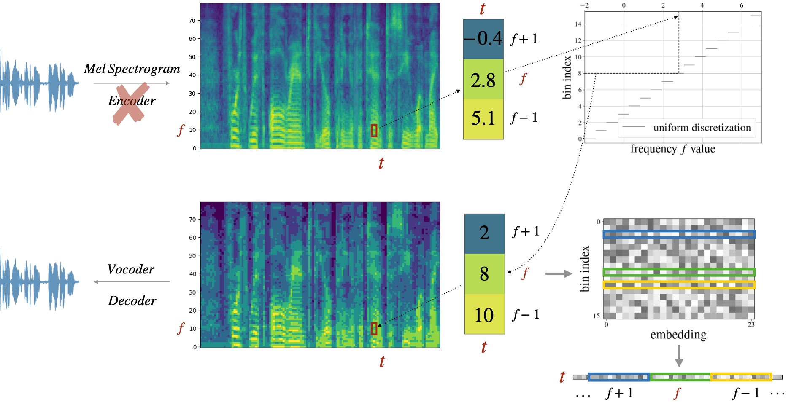

# dMel: Speech Tokenization Made Simple

This repository accompanies the research paper **[dMel: Speech Tokenization Made Simple](https://arxiv.org/pdf/2407.15835)** by *Bai, He and Likhomanenko, Tatiana and Zhang, Ruixiang and Gu, Zijin and Aldeneh, Zakaria and Jaitly, Navdeep* on speech tokenization for speech generation and speech recognition.

## Abstract

Large language models have revolutionized natural language processing by leveraging self-supervised pretraining on vast textual data. Inspired by this success, researchers have investigated complicated speech tokenization methods to discretize continuous speech signals so that language modeling techniques can be
applied to speech data. However, existing approaches either model semantic (content) tokens, potentially losing acoustic information, or model acoustic tokens, risking the loss of semantic (content) information. Having multiple token types
also complicates the architecture and requires additional pretraining. Here we show that discretizing mel-filterbank channels into discrete intensity bins produces a simple representation (dMel), that performs better than other existing speech tokenization methods. Using an LM-style transformer architecture for speech-text modeling, we comprehensively evaluate different speech tokenization methods on speech recognition (ASR) and speech synthesis (TTS). Our results demonstrate the effectiveness of dMel in achieving high performance on both tasks within a unified framework, paving the way for efficient and effective joint modeling of speech and text.

<p align="center">
  <a href="path/to/file.pdf">
    
  </a>
</p>

## Generated Samples

The repository provides examples of the generated speech for models trained on [LibriSpeech dataset](https://www.openslr.org/12):
we show both normal length generation and longform generation.

## License

- Repository is released under [LICENSE](LICENSE). 
- All generated speech samples provided here are licensed under [LICENSE-speech-samples.md](LICENSE-speech-samples.md).

## Citations

```
@article{bai2024dmel,
  title={dMel: Speech Tokenization Made Simple},
  author={Bai, He and Likhomanenko, Tatiana and Zhang, Ruixiang and Gu, Zijin and Aldeneh, Zakaria and Jaitly, Navdeep},
  journal={arXiv preprint arXiv:2407.15835},
  year={2024}
}
```
